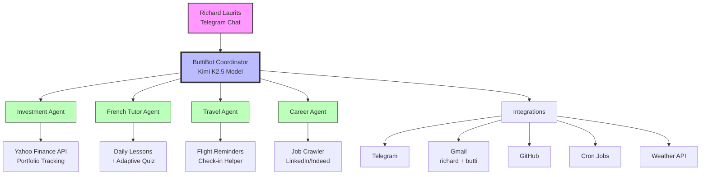

# ButtiBot System Visualization

## 1. ASCII Art Version

```
                    ┌─────────────────┐
                    │    RICHARD      │
                    │   (Telegram)    │
                    └────────┬────────┘
                             │
                             ▼
            ┌────────────────────────────────┐
            │      BUTTIBOT COORDINATOR      │
            │  (Main Session - Kimi K2.5)    │
            └────────┬───────────┬───────────┘
                     │           │
         ┌───────────┼───────────┼───────────┐
         │           │           │           │
         ▼           ▼           ▼           ▼
    ┌────────┐  ┌────────┐  ┌────────┐  ┌────────┐
    │INVEST  │  │FRENCH  │  │TRAVEL  │  │CAREER  │
    │AGENT   │  │TUTOR   │  │AGENT   │  │AGENT   │
    └───┬────┘  └───┬────┘  └───┬────┘  └───┬────┘
        │           │           │           │
        ▼           ▼           ▼           ▼
   ┌─────────┐  ┌─────────┐  ┌─────────┐  ┌─────────┐
   │Yahoo    │  │Daily    │  │Flight   │  │Job      │
   │Finance  │  │Lessons  │  │Tracking │  │Crawler  │
   │API      │  │+ Quiz   │  │+Alerts  │  │         │
   └─────────┘  └─────────┘  └─────────┘  └─────────┘
        │           │           │           │
        └───────────┴───────────┴───────────┘
                        │
                        ▼
              ┌───────────────────┐
              │   INTEGRATIONS    │
              ├───────────────────┤
              │ • Telegram        │
              │ • Gmail (2 acc)   │
              │ • GitHub          │
              │ • Weather API     │
              │ • Cron Jobs       │
              └───────────────────┘
```

## 2. Mermaid Version



## 3. Simple ASCII (Compact)

```
    RICHARD
       │
       ▼
   BUTTIBOT ◄──► Telegram
       │
       ├──► 💰 Investment (Stocks)
       ├──► 🇫🇷 French (Lessons)
       ├──► ✈️ Travel (Flights)
       └──--> 💼 Career (Jobs)
       │
       └──--> 📧 Gmail | 🌤️ Weather | ⏰ Cron
```

## Comparison

| Feature | ASCII Art | Mermaid |
|---------|-----------|---------|
| **Style** | Hand-crafted, artistic | Clean, professional |
| **Editable** | Manual text editing | Code-based, auto-layout |
| **Renders** | Always visible | Needs Mermaid renderer |
| **Best for** | Quick sketches, CLI | Documentation, presentations |
| **GitHub** | ✅ Works everywhere | ✅ Renders in README |
| **Colors** | Limited | Full color support |

---
Generated by ButtiBot for Richard
